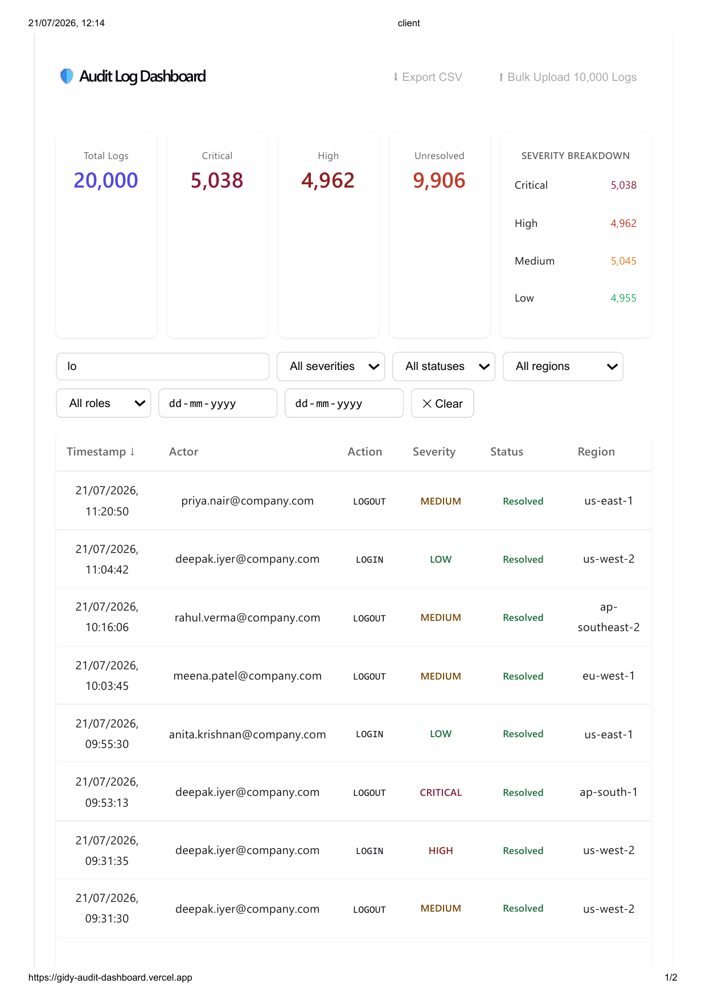
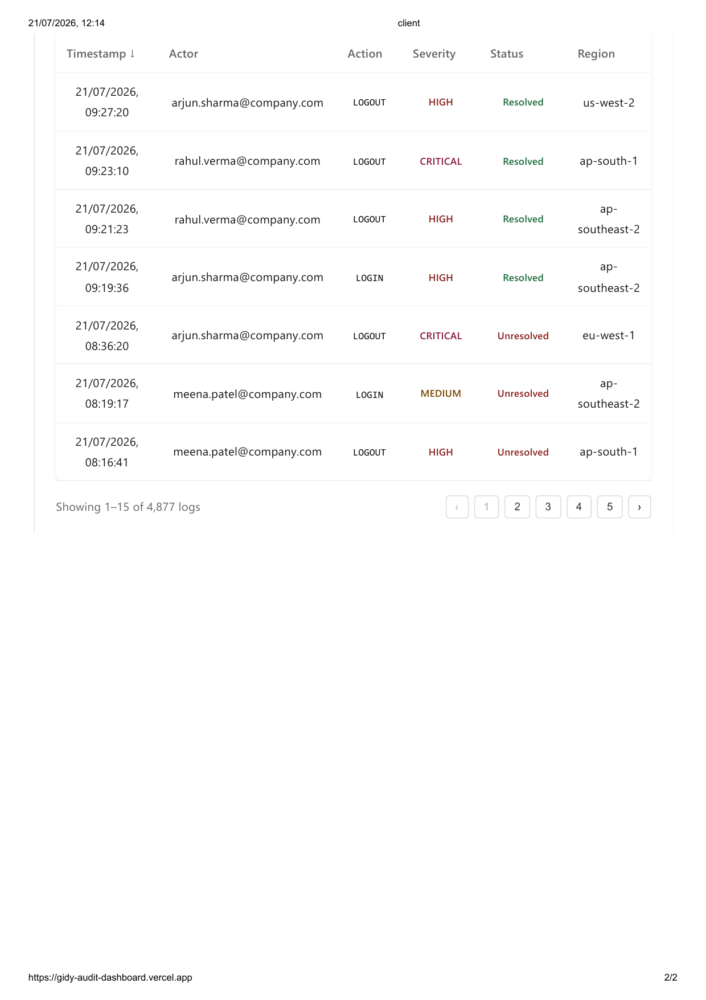

# Gidy Audit Dashboard

A full-stack dashboard that lets security engineers upload, view, and investigate system audit logs — built for the Gidy Full Stack Exercise (Associate Software Engineer assessment).

**🔗 Live Demo:** [gidy-audit-dashboard.vercel.app](https://gidy-audit-dashboard.vercel.app/)
**📦 Repository:** [github.com/manonmani27/gidy-audit-dashboard](https://github.com/manonmani27/gidy-audit-dashboard)

---

## Overview

This project implements the requirements from the exercise brief:

- A **bulk upload API** that accepts and stores 10,000 log records in a single request
- A **dashboard** to view stored logs
- **Filtering** by multiple fields (severity, status, region, role, actor/action/resource/IP search, date range)
- **Search, sort, and pagination**, performed server-side as required

Each log record follows the specified schema: `actor`, `role`, `action`, `resource`, `resourceType`, `ipAddress`, `region`, `severity`, `status`, `timestamp`.

---

## Features

- **Live audit log table** — timestamp, actor, action, severity, status, and region for every event
- **Search** — filter logs by actor, action, resource, or IP address
- **Multi-filter support** — filter by severity, status, region, and role simultaneously
- **Date range filter** — narrow results to a specific time window
- **CSV export** — download filtered log data for offline analysis or reporting
- **Severity breakdown chart** — visual bar chart summarizing Critical / High / Medium / Low events
- **Summary cards** — at-a-glance totals for Total Logs, Critical, High, and Unresolved counts
- **Bulk upload** — seed/generate 10,000 log records via a single API request
- **Server-side pagination, filtering, sorting, and search** — the client never receives the full dataset; all query logic runs on the backend against MongoDB, so the UI stays fast even with 20,000+ records
- **Responsive design** — works on desktop and mobile

---

## Tech Stack

**Frontend**
- React (Vite)
- Deployed on [Vercel](https://vercel.com)

**Backend**
- Node.js + Express
- Deployed on [Render](https://render.com)

**Database**
- MongoDB Atlas (cloud-hosted)

---

## Screenshots




---

## Getting Started (Local Setup)

### Prerequisites
- [Node.js](https://nodejs.org) (v18 or higher recommended)
- A [MongoDB Atlas](https://www.mongodb.com/atlas) account and cluster

### 1. Clone the repository
```bash
git clone https://github.com/manonmani27/gidy-audit-dashboard.git
cd gidy-audit-dashboard
```

### 2. Set up the backend
```bash
cd server
npm install
```

Create a `.env` file inside `server/` with:
```
MONGODB_URI=your_mongodb_connection_string
PORT=5000
```

Start the server:
```bash
node server.js
```

### 3. Set up the frontend
```bash
cd ../client
npm install
npm run dev
```

The app will be available at `http://localhost:5173` (or whichever port Vite assigns), connecting to your local backend at `http://localhost:5000`.

---

## Environment Variables

| Variable | Description |
|---|---|
| `MONGODB_URI` | MongoDB Atlas connection string |
| `PORT` | Port for the backend server (default: 5000) |

> ⚠️ Never commit your `.env` file. It's excluded via `.gitignore`.

---

## Deployment

- **Frontend** is deployed on Vercel, auto-deploying from the `main` branch.
- **Backend** is deployed on Render, connected to a MongoDB Atlas cluster.

---

## Technical Decisions

- **React (Vite) for the frontend** — fast dev server and build times, minimal config, well-suited for a data-heavy dashboard UI.
- **Node.js + Express for the backend** — straightforward to set up a REST API with clear route separation for logs, filters, and bulk upload.
- **MongoDB for storage** — the log schema is naturally document-shaped (flat fields, no complex relations), and MongoDB's query/index support made server-side filtering and pagination simple to implement.
- **Server-side filtering, search, sorting, and pagination** — required by the brief, and necessary in practice: with 20,000+ records, sending the full dataset to the client would be slow and wasteful. All query logic (filters, search, sort, skip/limit) runs against MongoDB on the backend; the frontend only ever receives the current page of results.
- **Bulk upload endpoint** — accepts an array of log records in a single POST request and inserts them with `insertMany` for efficiency, rather than one-by-one inserts.
- **CSV export** — implemented client-side against the currently filtered result set, so exports match exactly what the user is looking at.
- **Hosting split (Vercel + Render + Atlas)** — chosen for free-tier availability and simplicity: Vercel for the static frontend, Render for the Node API, MongoDB Atlas for a managed database, avoiding the need to manage any infrastructure directly.
- **Environment variables for secrets** — the MongoDB connection string is kept out of source control via `.env` + `.gitignore`, and configured separately as an environment variable on Render for production.

---

## License

This project was built as a technical assessment submission.
